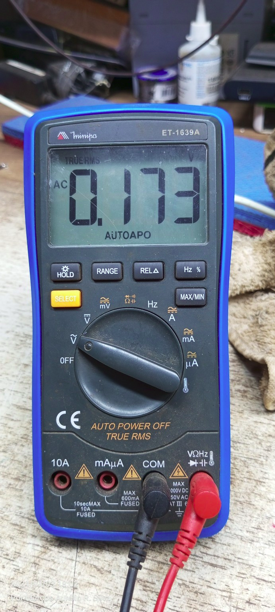
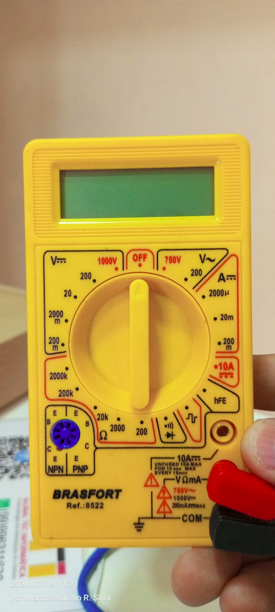

# Ferramentas de Testes de Eletrônica

> ### Multímetro Minipa ET-1639A

Para medir um capacitor com o seu multímetro Minipa ET-1639A, siga os passos abaixo:

1. **Descarregue o Capacitor**: Antes de medir, certifique-se de que o capacitor esteja descarregado para evitar danos ao multímetro ou a você mesmo. Para descarregar um capacitor, você pode usar uma resistência de alto valor (cerca de 10kΩ) e conectá-la entre os terminais do capacitor por alguns segundos.

2. **Configure o Multímetro**: Gire o seletor do multímetro para a função de capacitância. Esta função geralmente é representada por um símbolo de capacitor (duas linhas paralelas).

3. **Conecte os Cabos de Teste**: 
    - Conecte o cabo vermelho na entrada do multímetro marcada com o símbolo de capacitância ou "Ω".
    - Conecte o cabo preto na entrada COM.

4. **Meça o Capacitor**:
    - Conecte os cabos de teste aos terminais do capacitor (não importa a polaridade para capacitores não polarizados).
    - Se o capacitor for polarizado (como os eletrolíticos), conecte o cabo vermelho ao terminal positivo e o cabo preto ao terminal negativo.

5. **Leia o Valor**: O valor da capacitância será exibido no visor do multímetro. Certifique-se de que a leitura está dentro da faixa esperada para o capacitor que você está testando.

Lembre-se de que capacitores eletrolíticos têm polaridade, então conecte corretamente os cabos de teste. Além disso, capacitores muito grandes podem demorar alguns segundos para que o multímetro exiba uma leitura estável.

Aqui estão os passos ilustrados com base na configuração do seu multímetro:

1. **Descarregue o capacitor antes da medição.**
2. **Gire o seletor do multímetro para a função de capacitância (símbolo de capacitor).**
3. **Conecte os cabos de teste corretamente.**
4. **Conecte os cabos de teste aos terminais do capacitor.**
5. **Leia o valor da capacitância exibido no visor.**

Se precisar de mais alguma informação ou ajuda, estou à disposição!

---
> ### Multímetro Brasfort Ref. 8522

O seu multímetro Brasfort Ref. 8522 possui várias escalas e funções. Vou explicar cada uma delas e como utilizá-las para medir diferentes componentes.

### Escalas do Multímetro

1. **V\~ (Volts AC)**
   - **750V / 200V**: Use essas escalas para medir tensões alternadas (AC). Coloque o seletor na faixa adequada dependendo da tensão que você espera medir.

2. **V-- (Volts DC)**
   - **1000V, 200V, 20V, 2V, 200mV**: Use essas escalas para medir tensões contínuas (DC). Se você não sabe a tensão aproximada, comece com a escala mais alta (1000V) e vá diminuindo até obter uma leitura precisa.

3. **A-- (Corrente DC)**
   - **10A, 200mA, 20mA, 2000µ**: Use essas escalas para medir corrente contínua. A escala de 10A é não-fusível e deve ser usada por um tempo máximo de 10 segundos a cada 15 minutos.

4. **Ω (Resistência)**
   - **2000kΩ, 200kΩ, 20kΩ, 2000Ω, 200Ω**: Use essas escalas para medir resistência. Coloque o seletor na faixa adequada dependendo da resistência que você espera medir.

5. **hFE (Ganho de Transistor)**
   - Use essa função para medir o ganho de corrente de transistores NPN e PNP. Insira os terminais do transistor nos soquetes correspondentes (B, C, E) conforme indicado.

6. **Diodo e Continuidade**
   - **Símbolo de diodo**: Use essa função para testar diodos e continuidade. Ao testar continuidade, um som será emitido se houver continuidade (resistência baixa).

7. **Capacitância**
   - **Símbolo de capacitor (nF, µF)**: Esta função geralmente é usada para medir capacitância, mas parece não estar disponível especificamente neste multímetro.

### Como Utilizar

1. **Medir Tensão AC (V\~)**
   - Configure o seletor em 750V ou 200V conforme a tensão esperada.
   - Conecte as pontas de prova aos terminais do circuito a ser medido.
   - Leia o valor no display.

2. **Medir Tensão DC (V--)**
   - Configure o seletor na faixa apropriada (comece com 1000V e ajuste conforme necessário).
   - Conecte as pontas de prova aos terminais do circuito, observando a polaridade (vermelho no positivo e preto no negativo).
   - Leia o valor no display.

3. **Medir Corrente DC (A--)**
   - Configure o seletor na faixa apropriada (comece com 10A se não souber a corrente esperada).
   - Desconecte a alimentação do circuito.
   - Conecte as pontas de prova em série com o circuito (o multímetro deve ser parte do caminho da corrente).
   - Leia o valor no display.

4. **Medir Resistência (Ω)**
   - Configure o seletor na faixa apropriada.
   - Conecte as pontas de prova aos terminais do componente a ser medido (desconecte o componente do circuito se necessário).
   - Leia o valor no display.

5. **Testar Diodos e Continuidade**
   - Configure o seletor na função de diodo.
   - Conecte as pontas de prova aos terminais do diodo (vermelho no ânodo e preto no cátodo).
   - Leia o valor no display (um diodo em bom estado mostrará uma queda de tensão entre 0,5V e 0,8V).
   - Para continuidade, um som será emitido se houver continuidade.

6. **Medir Ganho de Transistor (hFE)**
   - Configure o seletor na função hFE.
   - Insira os terminais do transistor nos soquetes correspondentes (B, C, E).
   - Leia o valor do ganho no display.

Lembre-se sempre de ajustar a faixa de medição conforme necessário e de desconectar a alimentação dos circuitos antes de realizar medições de resistência e continuidade para evitar danos ao multímetro e garantir sua segurança.

---

